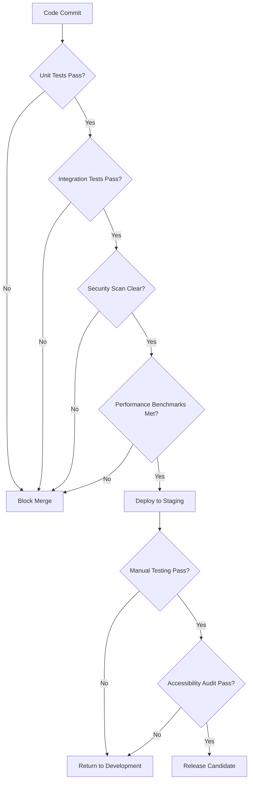

# ADHD Focus Alarm App - QA Testing Strategy & Test Plan
**Document Version:** 1.0  
**Date:** September 2025  
**QA Lead:** Senior QA Engineer  
**Classification:** Internal Testing

---

## Table of Contents
1. [Testing Strategy Overview](#testing-strategy-overview)
2. [Test Pyramid Implementation](#test-pyramid-implementation)
3. [Device Compatibility Matrix](#device-compatibility-matrix)
4. [Functional Test Cases](#functional-test-cases)
5. [Performance Testing](#performance-testing)
6. [Security Testing](#security-testing)
7. [Accessibility Testing](#accessibility-testing)
8. [Test Automation Framework](#test-automation-framework)

---

## Testing Strategy Overview

### Testing Philosophy
Our testing strategy follows the **"Shift Left"** approach, emphasizing early defect detection and prevention. Given the critical nature of alarm functionality for ADHD users, we implement a **Zero Tolerance Policy** for alarm-related failures.

### Quality Gates


### Critical Success Criteria
- **Alarm Reliability:** 99.9% success rate across all supported devices
- **Crash-Free Sessions:** >99.5% crash-free user sessions
- **Performance:** App launch <2 seconds, mission loading <1 second
- **Accessibility:** WCAG 2.1 AA compliance with zero critical violations
- **Security:** Zero critical or high-severity vulnerabilities

---

## Test Pyramid Implementation

### Unit Tests (70% of total tests)
**Target Coverage:** 90% for critical alarm functionality, 80% overall

```kotlin
// Example critical alarm test
@Test
fun `alarm triggers at exact scheduled time within 500ms tolerance`() = runTest {
    // Given
    val scheduledTime = System.currentTimeMillis() + 10000 // 10 seconds from now
    val alarm = createTestAlarm(scheduledTime)
    
    // When
    alarmManager.scheduleAlarm(alarm)
    
    // Then
    advanceTimeBy(10000)
    val actualTriggerTime = alarmTriggerCapture.lastTriggerTime
    assertThat(actualTriggerTime).isWithin(500).of(scheduledTime)
}

@Test
fun `alarm persists after device reboot`() = runTest {
    // Given
    val alarm = createTestAlarm()
    alarmManager.scheduleAlarm(alarm)
    
    // When
    simulateDeviceReboot()
    
    // Then
    val restoredAlarms = alarmManager.getScheduledAlarms()
    assertThat(restoredAlarms).contains(alarm)
}
```

**Critical Unit Test Categories:**
1. **Alarm Scheduling Logic** - 45 test cases
2. **Mission Validation Logic** - 35 test cases
3. **Data Persistence** - 25 test cases
4. **Audio/Vibration Management** - 20 test cases
5. **Focus Mode Blocking** - 30 test cases

### Integration Tests (20% of total tests)
**Focus Areas:**
- Database operations with Room
- Service communication between components
- Permission handling workflows
- Third-party library integration

```kotlin
@Test
fun `complete alarm flow from creation to mission completion`() = runTest {
    // Test full user journey
    val alarmId = alarmRepository.createAlarm(testAlarm)
    systemClock.advanceToAlarmTime()
    
    val missionSession = missionEngine.startMission(alarmId)
    val result = missionEngine.completeMission(missionSession.id, correctAnswer)
    
    assertThat(result.success).isTrue()
    assertThat(alarmService.isAlarmActive(alarmId)).isFalse()
}
```

### End-to-End Tests (10% of total tests)
**UI Automation with Espresso:**

```kotlin
@Test
fun createAndTriggerAlarmE2E() {
    // Navigate to alarm creation
    onView(withId(R.id.fab_add_alarm)).perform(click())
    
    // Set alarm for 2 minutes from now
    onView(withId(R.id.time_picker)).perform(setTime(currentHour, currentMinute + 2))
    
    // Select math mission
    onView(withId(R.id.spinner_mission)).perform(click())
    onView(withText("Math Challenge")).perform(click())
    
    // Save alarm
    onView(withId(R.id.btn_save)).perform(click())
    
    // Wait for alarm to trigger
    IdlingRegistry.getInstance().register(AlarmTriggerIdlingResource())
    
    // Verify mission screen appears
    onView(withId(R.id.mission_math_layout)).check(matches(isDisplayed()))
    
    // Complete mission
    onView(withId(R.id.answer_input)).perform(typeText("42"))
    onView(withId(R.id.btn_submit)).perform(click())
    
    // Verify alarm dismissed
    onView(withId(R.id.main_activity)).check(matches(isDisplayed()))
}
```

---

## Device Compatibility Matrix

### Primary Test Devices (Must Test)
| Device | Android Version | RAM | Screen Size | Notes |
|--------|----------------|-----|-------------|--------|
| Samsung Galaxy S21 | Android 13 | 8GB | 6.2" | Samsung UI modifications |
| Google Pixel 6 | Android 14 | 8GB | 6.4" | Stock Android baseline |
| OnePlus 9 | Android 13 | 8GB | 6.55" | OxygenOS optimizations |
| Xiaomi Redmi Note 10 | Android 12 | 4GB | 6.43" | MIUI aggressive battery mgmt |
| Samsung Galaxy A32 | Android 12 | 4GB | 6.4" | Lower-end Samsung device |

### Secondary Test Devices (Selective Testing)
| Device | Android Version | RAM | Screen Size | Test Focus |
|--------|----------------|-----|-------------|------------|
| LG V60 | Android 11 | 8GB | 6.8" | Large screen layouts |
| Sony Xperia 5 | Android 12 | 8GB | 6.1" | Audio optimization |
| Motorola Edge | Android 12 | 6GB | 6.7" | Near-stock Android |
| Samsung Galaxy Tab S7 | Android 12 | 6GB | 11" | Tablet optimization |

### Critical Test Scenarios by Manufacturer

**Samsung Devices:**
- Knox security impact on alarm permissions
- Bixby routine conflicts
- Samsung Health integration conflicts
- One UI notification modifications

**Xiaomi/MIUI Devices:**
- Aggressive battery optimization bypass
- Auto-start management permissions
- MIUI-specific permission dialogs
- Battery saver mode impacts

**OnePlus/OxygenOS Devices:**
- Zen Mode conflicts with focus mode
- Gaming mode interactions
- Battery optimization settings

---

## Functional Test Cases

### Alarm Core Functionality (Priority: Critical)

#### Test Case AC-001: Basic Alarm Creation
**Preconditions:** App installed, permissions granted  
**Steps:**
1. Open ADHD Alarm app
2. Tap "+" to create new alarm
3. Set time to 5 minutes from current time
4. Select "Math Challenge" mission
5. Tap "Save"

**Expected Results:**
- Alarm appears in alarm list with correct time
- Status shows "Active" with green indicator
- System notification shows alarm is scheduled
- AlarmManager system alarm is set correctly

**Test Data:** Time variations: AM/PM, 24-hour format, different timezones

#### Test Case AC-002: Alarm Triggers at Correct Time
**Preconditions:** Alarm set for specific time, device awake  
**Steps:**
1. Set device clock to 1 minute before alarm time
2. Lock device
3. Wait for alarm time
4. Observe alarm trigger

**Expected Results:**
- Alarm triggers within 500ms of scheduled time
- Screen turns on and shows mission interface
- Audio plays at maximum volume
- Vibration pattern starts immediately

**Variations:** Test with device in Do Not Disturb, airplane mode, low battery

#### Test Case AC-003: Mission Completion Flow
**Preconditions:** Alarm triggered, mission screen displayed  
**Steps:**
1. Observe mission type and requirements
2. Complete mission successfully
3. Verify alarm dismissal

**Expected Results:**
- Mission requirements clearly displayed
- Correct answer acceptance works properly
- Alarm stops immediately upon mission completion
- Success logged in analytics

**Mission Types to Test:**
- Math: Easy (2+3), Medium (23×17), Hard (√144 + 15²)
- Barcode: Various formats (QR, Code128, EAN)
- Photo: Different lighting conditions, angles
- Physical: Various movement intensities
- Typing: Short quotes, long quotes, special characters

### Focus Mode Functionality (Priority: High)

#### Test Case FM-001: Social Media Blocking
**Preconditions:** Focus mode enabled, social media apps installed  
**Steps:**
1. Enable 1-hour social media blocking
2. Attempt to open Instagram
3. Observe blocking behavior
4. Test override mechanism

**Expected Results:**
- Instagram launch intercepted within 200ms
- Blocking overlay displays with explanation
- Override requires 30-second wait + confirmation
- Other non-blocked apps function normally

#### Test Case FM-002: Custom Focus Schedule
**Preconditions:** None  
**Steps:**
1. Create custom focus session (9 AM - 11 AM)
2. Set blocked apps (Instagram, TikTok, Twitter)
3. Schedule for weekdays only
4. Test at scheduled time

**Expected Results:**
- Focus session activates automatically at 9 AM
- Only specified apps are blocked
- Session ends automatically at 11 AM
- Weekend scheduling respected

### Sleep Tracking (Priority: Medium)

#### Test Case ST-001: Sleep Detection
**Preconditions:** Sleep tracking enabled  
**Steps:**
1. Place phone on bedside table
2. Simulate sleep movement patterns
3. Check sleep data in morning

**Expected Results:**
- Sleep start time detected within 15 minutes
- Movement patterns recorded accurately
- Wake time correlates with alarm or natural wake
- Sleep quality score calculated

---

## Performance Testing

### Load Testing Scenarios

#### Scenario PT-001: Multiple Simultaneous Alarms
**Test Setup:**
- Create 50 alarms with 1-minute intervals
- Monitor app performance and memory usage
- Verify all alarms trigger correctly

**Performance Criteria:**
- Memory usage increases linearly, not exponentially
- App remains responsive (<200ms UI interactions)
- All alarms trigger within 500ms tolerance
- No memory leaks detected

#### Scenario PT-002: Large Custom Sound Library
**Test Setup:**
- Upload 100 custom MP3 files (various sizes: 500KB - 5MB)
- Create alarms using different custom sounds
- Test app startup and navigation performance

**Performance Criteria:**
- App startup time <3 seconds with full sound library
- Sound preview plays within 500ms
- No audio stuttering or quality degradation
- Storage management prevents excessive disk usage

#### Scenario PT-003: Extended Focus Session
**Test Setup:**
- Run 8-hour focus session with app blocking
- Monitor battery usage and system performance
- Test with 50+ app launch attempts per hour

**Performance Criteria:**
- Battery usage <5% over 8 hours
- App blocking response time <200ms consistently
- No service crashes or restarts
- System performance remains stable

### Stress Testing

#### Memory Stress Test
```bash
# Automated stress test script
adb shell monkey -p com.adhdapp.focusalarm \
  --throttle 100 \
  --pct-syskeys 0 \
  --pct-appswitch 0 \
  -v 10000
```

**Monitoring:**
- Memory leaks using LeakCanary
- CPU usage patterns
- Battery drain analysis
- ANR (Application Not Responding) detection

---

## Security Testing

### Data Protection Tests

#### Test Case SEC-001: Encrypted Data Storage
**Objective:** Verify all sensitive data is encrypted at rest  
**Method:**
1. Root test device
2. Extract app database file
3. Attempt to read alarm times, custom sounds, sleep data
4. Verify encryption implementation

**Success Criteria:**
- All sensitive data fields encrypted with AES-256
- Encryption keys properly managed via Android Keystore
- No plain text sensitive data in database
- Backup files also encrypted

#### Test Case SEC-002: Permission Abuse Prevention
**Objective:** Ensure app only uses necessary permissions  
**Method:**
1. Audit all permission requests in manifest
2. Test app functionality with minimal permissions
3. Verify graceful degradation when permissions denied
4. Monitor for permission escalation attempts

**Success Criteria:**
- No unused permissions requested
- App functions with core permissions only
- Clear explanation for each permission request
- No attempts to bypass permission system

### Privacy Testing

#### Test Case PRI-001: Data Transmission Audit
**Objective:** Verify no unauthorized data transmission  
**Method:**
1. Set up network monitoring proxy
2. Use app for full day including all features
3. Analyze all network traffic
4. Verify against privacy policy

**Success Criteria:**
- No personal data transmitted without consent
- Analytics data properly anonymized
- All network requests use HTTPS
- No third-party trackers present

---

## Accessibility Testing

### Screen Reader Testing

#### Test Case ACC-001: VoiceOver/TalkBack Navigation
**Devices:** iOS with VoiceOver, Android with TalkBack  
**Test Flow:**
1. Navigate entire app using only screen reader
2. Create and configure alarm using voice commands
3. Complete mission using screen reader assistance
4. Verify all information is properly announced

**Success Criteria:**
- All UI elements have meaningful labels
- Navigation order is logical and predictable
- Mission instructions clearly communicated via audio
- No "unlabeled button" or similar accessibility errors

#### Test Case ACC-002: High Contrast and Large Text
**Test Configuration:**
- Enable high contrast mode
- Set text size to 200% (maximum system setting)
- Test all app screens and functions

**Success Criteria:**
- All text remains readable at maximum size
- No UI elements overlap or become unusable
- Color contrast ratios exceed 4.5:1 for normal text
- Essential information not conveyed by color alone

### Motor Accessibility Testing

#### Test Case ACC-003: Switch Navigation
**Test Setup:**
- Connect external switch to device
- Configure for single-switch scanning
- Test complete alarm setup and usage

**Success Criteria:**
- All functions accessible via switch navigation
- Scanning order logical and efficient
- Mission completion possible with limited mobility
- Adequate time provided for switch selections

---

## Test Automation Framework

### Continuous Integration Pipeline

```yaml
# GitHub Actions CI Pipeline
name: ADHD Alarm App CI/CD

on:
  push:
    branches: [main, develop]
  pull_request:
    branches: [main]

jobs:
  unit-tests:
    runs-on: ubuntu-latest
    steps:
      - uses: actions/checkout@v3
      - uses: actions/setup-java@v3
        with:
          java-version: '11'
      - run: ./gradlew testDebugUnitTest
      - run: ./gradlew jacocoTestReport
      
  integration-tests:
    runs-on: macOS-latest
    steps:
      - uses: actions/checkout@v3
      - uses: actions/setup-java@v3
        with:
          java-version: '11'
      - run: ./gradlew connectedAndroidTest
      
  security-scan:
    runs-on: ubuntu-latest
    steps:
      - uses: actions/checkout@v3
      - run: ./gradlew dependencyCheckAnalyze
      - run: ./gradlew detekt
      
  performance-test:
    runs-on: ubuntu-latest
    steps:
      - uses: actions/checkout@v3
      - run: ./gradlew benchmarkDebug
```

### Custom Testing Tools

#### AlarmReliabilityTester
```kotlin
class AlarmReliabilityTester {
    suspend fun runReliabilityTest(
        alarmCount: Int = 100,
        testDuration: Duration = 24.hours
    ): ReliabilityReport {
        val results = mutableListOf<AlarmTestResult>()
        
        repeat(alarmCount) { index ->
            val testAlarm = createTestAlarm(
                time = generateRandomTime(),
                missionType = MissionType.values().random()
            )
            
            val result = testSingleAlarm(testAlarm)
            results.add(result)
            
            delay(testDuration / alarmCount)
        }
        
        return ReliabilityReport(
            totalTests = alarmCount,
            successCount = results.count { it.triggered && it.missionCompleted },
            averageTriggerAccuracy = results.map { it.triggerAccuracy }.average(),
            failureReasons = results.filter { !it.triggered }.groupBy { it.failureReason }
        )
    }
}
```

### Test Data Management

#### Test Data Factory
```kotlin
object TestDataFactory {
    fun createTestAlarm(
        time: String = "09:00",
        missionType: MissionType